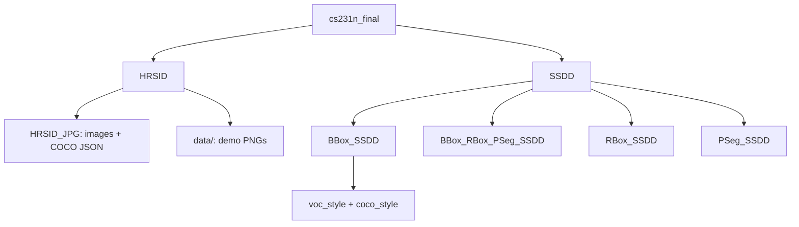

# Ship Detection in SAR Satellite Imagery

This repository supports **ship detection and instance segmentation** in **synthetic aperture radar (SAR)** imagery. It bundles two public benchmarks—**HRSID** (High-Resolution SAR Images Dataset) and **SSDD** (SAR Ship Detection Dataset)—with upstream labeling utilities.

The repo currently contains **datasets plus SSDD helper scripts**.

## SAR scenes are often stored as **3-channel JPEG** files so standard vision tooling (OpenCV, COCO loaders) can read them, even when the underlying signal is grayscale.

## Repository layout

```
cs231n_final/
├── README.md                 # This file
├── HRSID/                    # High-Resolution SAR Images Dataset
│   ├── README.md             # Upstream docs, citations, download links
│   ├── LICENSE
│   ├── HRSID_JPG/            # PRIMARY — full JPG release (use this)
│   │   ├── JPEGImages/       # 5,604 .jpg tiles
│   │   └── annotations/      # COCO JSON splits
│   └── data/                 # Demo PNG tiles + masks (README figures only)
└── SSDD/                     # SAR Ship Detection Dataset
    ├── BBox_SSDD/            # Horizontal bounding boxes only
    ├── BBox_RBox_PSeg_SSDD/  # BBox + rotated box + polygon segmentation
    ├── RBox_SSDD/            # Rotated bounding boxes
    └── PSeg_SSDD/           # Polygon instance segmentation
```

Each SSDD variant contains the same **1,160** images; only the **label type** differs under `voc_style/` and `coco_style/`.




---

## Quick start:


| Goal                              | Path                                                                                                      |
| --------------------------------- | --------------------------------------------------------------------------------------------------------- |
| Full HRSID (all images + labels)  | `HRSID/HRSID_JPG/JPEGImages/` + `HRSID/HRSID_JPG/annotations/train_test2017.json`                         |
| HRSID official train / test split | `train2017.json` (3,642 images) + `test2017.json` (1,962 images) under `HRSID/HRSID_JPG/annotations/`     |
| SSDD, horizontal boxes only       | `SSDD/BBox_SSDD/voc_style/` or `SSDD/BBox_SSDD/coco_style/`                                               |
| SSDD, rotated boxes + masks       | `SSDD/BBox_RBox_PSeg_SSDD/`                                                                               |
| Explore richest SSDD labels       | `SSDD/BBox_RBox_PSeg_SSDD/voc_style/`                                                                     |
| Visualize SSDD (COCO)             | `cd SSDD/BBox_SSDD/coco_style` then run `visualization_coco.py` (see [Utility scripts](#utility-scripts)) |


---

## Dataset inventory

### SSDD — complete (vendored)


| Item                    | Count / location                                                              |
| ----------------------- | ----------------------------------------------------------------------------- |
| Images per variant      | **1,160** in `voc_style/JPEGImages/`                                          |
| Train / test (VOC)      | **928** / **232** in `Annotations_train/`, `Annotations_test/`                |
| Test inshore / offshore | **46** / **186** in `Annotations_test_inshore/`, `Annotations_test_offshore/` |
| Full-set VOC XML        | `Annotations/` (all 1,160)                                                    |
| COCO JSON               | `coco_style/annotations/{train,test,test_inshore,test_offshore}.json`         |
| COCO images             | `coco_style/images/{train,test,test_inshore,test_offshore}/`                  |
| Image list files        | `voc_style/ImageSets/Main/{train,test,test_inshore,test_offshore}.txt`        |


Approximate on-disk size under `SSDD/`: **~1.1 GB** (images are duplicated across the four variants).

### HRSID — use `HRSID_JPG/`


| Item                  | Count / location                                            |
| --------------------- | ----------------------------------------------------------- |
| Images                | **5,604** `.jpg` files in `HRSID/HRSID_JPG/JPEGImages/`     |
| Full COCO annotations | `train_test2017.json` — 5,604 images, 16,951 ship instances |
| Train split           | `train2017.json` — 3,642 images, 11,047 instances           |
| Test split            | `test2017.json` — 1,962 images, 5,922 instances             |
| Single category       | `ship`                                                      |


**Canonical layout:** always prefer `HRSID/HRSID_JPG/` for training and evaluation.

**Do not use for full-dataset training:**

- `HRSID/data/` — four demo scenes with instance masks for the upstream README figures only.

Optional extras (negative samples, high-fidelity PNG release, extended inshore/offshore tags) are described in [HRSID/README.md](HRSID/README.md).

### Verify datasets on disk

```bash
# SSDD — expect 1160
ls SSDD/BBox_SSDD/voc_style/JPEGImages | wc -l

# HRSID — expect 5604
ls HRSID/HRSID_JPG/JPEGImages | wc -l
```

Python check that COCO `file_name` values resolve to JPEGs:

```python
import json, os

root = "HRSID/HRSID_JPG"
with open(f"{root}/annotations/train_test2017.json") as f:
    coco = json.load(f)
img_dir = f"{root}/JPEGImages"
missing = [
    im["file_name"]
    for im in coco["images"]
    if not os.path.isfile(os.path.join(img_dir, im["file_name"]))
]
print(f"missing: {len(missing)} / {len(coco['images'])}")  # expect missing: 0 / 5604
```

---

## Label formats

### HRSID (COCO)

Annotations live under `HRSID/HRSID_JPG/annotations/` as standard [COCO](https://cocodataset.org/#format-data) JSON:

- `images[]` — `id`, `file_name`, `width`, `height`
- `annotations[]` — `image_id`, `category_id`, `bbox` `[x, y, width, height]`, `area`, `segmentation`, `iscrowd`
- `categories[]` — one class: **ship**

Each `file_name` (e.g. `P0001_0_800_10190_10990.jpg`) must exist in `HRSID_JPG/JPEGImages/`.

### SSDD (Pascal VOC XML)

Under each variant’s `voc_style/`:


| Directory                    | Purpose                     |
| ---------------------------- | --------------------------- |
| `JPEGImages/`                | `000001.jpg` … `001160.jpg` |
| `Annotations/`               | XML for all 1,160 images    |
| `Annotations_train/`         | Train split XML (928)       |
| `Annotations_test/`          | Test split XML (232)        |
| `Annotations_test_inshore/`  | Inshore test subset (46)    |
| `Annotations_test_offshore/` | Offshore test subset (186)  |


Example axis-aligned box (`BBox_SSDD`):

```xml
<object>
  <name>ship</name>
  <bndbox>
    <xmin>218</xmin><ymin>48</ymin>
    <xmax>266</xmax><ymax>146</ymax>
  </bndbox>
</object>
```

In `BBox_RBox_PSeg_SSDD`, XML objects also include **rotated box** fields and **polygon** `segm` nodes. CSV files such as `train_labels.csv` and `test_labels.csv` are intermediate sources; `convert2voc.py` can regenerate XML from them.

### SSDD (COCO)

Under `coco_style/`:

- `annotations/train.json`, `test.json`, `test_inshore.json`, `test_offshore.json`
- Images mirrored under `coco_style/images/{train,test,test_inshore,test_offshore}/`

Run visualization from the `coco_style` directory so relative paths in scripts resolve correctly.

---

## SSDD variants

All four subfolders share the same image IDs; choose based on the label geometry you need.


| Subfolder             | Labels                                               |
| --------------------- | ---------------------------------------------------- |
| `BBox_SSDD`           | Axis-aligned bounding boxes                          |
| `RBox_SSDD`           | Rotated bounding boxes                               |
| `PSeg_SSDD`           | Polygon instance segmentation                        |
| `BBox_RBox_PSeg_SSDD` | Bounding boxes, rotated boxes, and polygons together |


**Recommendation**

- `**BBox_SSDD`** — standard horizontal-box detectors (Faster R-CNN, YOLO-style heads, etc.).
- `**BBox_RBox_PSeg_SSDD**` — exploration, rotated-box methods, or mask-based instance segmentation.

Internal layout per variant:

```
SSDD/<Variant>/
├── voc_style/
│   ├── JPEGImages/
│   ├── Annotations/          # and Annotations_train/, Annotations_test/, …
│   ├── ImageSets/Main/
│   ├── *_labels.csv
│   ├── analyze_*.py
│   ├── label_on_images.py
│   └── convert2voc.py
└── coco_style/
    ├── annotations/
    ├── images/
    ├── visualization_coco.py
    └── plot_polylines.py
```

---

## Utility scripts

Scripts ship with the upstream SSDD release. They assume you run them from the directory that contains the paths they reference—**change into the relevant folder first**.

### `voc_style/` (per SSDD variant)


| Script               | Variant                            | Purpose                                   |
| -------------------- | ---------------------------------- | ----------------------------------------- |
| `analyze_bbox.py`    | `BBox_SSDD`, `BBox_RBox_PSeg_SSDD` | Statistics / plots for axis-aligned boxes |
| `analyze_rbox.py`    | `RBox_SSDD`, `BBox_RBox_PSeg_SSDD` | Rotated-box statistics                    |
| `analyze_pseg.py`    | `PSeg_SSDD`, `BBox_RBox_PSeg_SSDD` | Segmentation statistics                   |
| `label_on_images.py` | All                                | Overlay labels on images                  |
| `convert2voc.py`     | All                                | Build VOC XML from CSV label files        |


Example:

```bash
cd SSDD/BBox_SSDD/voc_style
python analyze_bbox.py
```

### `coco_style/` (`BBox_SSDD` and `BBox_RBox_PSeg_SSDD`)


| Script                  | Purpose                                            |
| ----------------------- | -------------------------------------------------- |
| `visualization_coco.py` | Load COCO JSON and display images with annotations |
| `plot_polylines.py`     | Plot polygon segmentations                         |
| `images/get_id.py`      | Helper for image IDs                               |


Example (requires `pycocotools`, `scikit-image`, `matplotlib`):

```bash
cd SSDD/BBox_SSDD/coco_style
python visualization_coco.py
```

---

## Citations and licenses

### HRSID

- Dataset documentation and download links: [HRSID/README.md](HRSID/README.md)
- License: [HRSID/LICENSE](HRSID/LICENSE)
- Citation (from upstream README):

> Shunjun Wei, Xiangfeng Zeng, Qizhe Qu, Mou Wang, Hao Su, Jun Shi. **HRSID: A High-Resolution SAR Images Dataset for Ship Detection and Instance Segmentation.** *IEEE Access*, 2020. [IEEE Xplore](https://ieeexplore.ieee.org/stamp/stamp.jsp?tp=&arnumber=9127939)

### SSDD

This tree follows the public **SAR Ship Detection Dataset (SSDD)** layout (VOC and COCO formats, inshore/offshore test splits). Cite the original SSDD publication and repository when you use these labels in a report or paper. No separate upstream `README` is vendored under `SSDD/` in this repo.

---

## Summary


| Dataset   | Images | Primary labels                        | Ready when                                         |
| --------- | ------ | ------------------------------------- | -------------------------------------------------- |
| **HRSID** | 5,604  | COCO JSON in `HRSID_JPG/annotations/` | `HRSID_JPG/JPEGImages/` has 5,604 JPGs             |
| **SSDD**  | 1,160  | VOC XML + COCO JSON per variant       | `voc_style/JPEGImages/` has 1,160 JPGs per variant |


